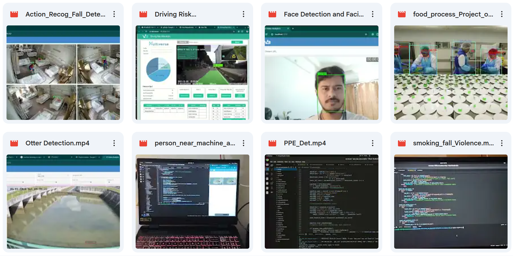

# 🚀 Computer Vision

## 🎯 Featured Projects

<p align="center">
  <a href="[https://your-project-link.com](https://drive.google.com/drive/folders/1R1nRiGa7XAcqbGWoCM4DwgXcmH-x5qw7?usp=drive_link)" target="_blank">
    
  </a>
  <br/>
  <sub>🔗 Click image to explore project</sub>
</p>
<p align="center">
  <a href="https://drive.google.com/drive/folders/1R1nRiGa7XAcqbGWoCM4DwgXcmH-x5qw7?usp=drive_link" target="_blank">
    
  </a>
</p>


### 🏥 Fall Detection & Pose-Based Action Recognition

Healthcare monitoring system with dual-verification fall detection to minimize false alarms.

<p align="center">
  <a href="https://drive.google.com/file/d/13RxMwLaq7YGJD2v5zUYro-U22Sfmx_T-/view?usp=drive_link" target="_blank">
    
  </a>
  <br/>
  <a href="https://drive.google.com/file/d/13RxMwLaq7YGJD2v5zUYro-U22Sfmx_T-/view?usp=drive_link" target="_blank">
    
  </a>
</p>

**Key Features:**
- Pose angle geometric verification (head-hip vertical, torso angle, limb collapse)
- ML classifier confirmation on keypoint sequences (8–16 frames)
- Temporal consistency checks (3–5 consecutive frames)
- ROI-based triggering (bed zones) with Kalman filter smoothing

**Results:** ~60–70% false positive reduction while maintaining >90% recall

### 🚗 Driver Behavior & Risk Analysis System

Real-time multi-camera system for fleet safety monitoring with harsh event detection.

<p align="center">
  <a href="https://drive.google.com/file/d/1XHQxBdtelfhjCL6Vc-FyJ0srEROyJTJY/view?usp=drive_link" target="_blank">
    
  </a>
  <br/>
  <a href="https://drive.google.com/file/d/1XHQxBdtelfhjCL6Vc-FyJ0srEROyJTJY/view?usp=drive_link" target="_blank">
    
  </a>
</p>

**Key Features:**
- Harsh braking/acceleration detection via sensor fusion + optical flow
- Lane departure & harsh turning detection with LaneNet-style models
- Pedestrian/vehicle proximity estimation using triangulation
- Real-time risk scoring and driver rating

**Tech Stack:** YOLOv11, TensorRT (INT8/FP16), DeepStream, Jetson Orin, Tornado WebSocket

---

### 👤 Face Detection & Facial Recognition

Real-time face detection and recognition system for attendance and access control.

<p align="center">
  <a href="https://drive.google.com/file/d/1sssbtpwauYcK1MgaDB7RPHQ_kV85REg7/view?usp=drive_link" target="_blank">
    
  </a>
  <br/>
  <a href="https://drive.google.com/file/d/1sssbtpwauYcK1MgaDB7RPHQ_kV85REg7/view?usp=drive_link" target="_blank">
    
  </a>
</p>

**Key Features:**
- Real-time multi-face detection and tracking
- Facial feature extraction and matching
- Attendance logging with timestamp
- Low-light optimization

---

### 🦦 Wildlife Monitoring & Otter Detection

Multi-camera wildlife counting and tracking system deployed across Singapore airports.

<p align="center">
  <a href="https://drive.google.com/file/d/1IZvwdOfD0QaEp7PUHJNRwFTK0AajF7iv/view?usp=drive_link" target="_blank">
    
  </a>
  <br/>
  <a href="https://drive.google.com/file/d/1IZvwdOfD0QaEp7PUHJNRwFTK0AajF7iv/view?usp=drive_link" target="_blank">
    
  </a>
</p>

**Key Features:**
- Small object detection at 50–100m range
- 1280×1280 input resolution with alternate mosaic augmentation
- Multi-camera DeepStream pipeline (30+ FPS)
- Dataset cleaning with night/low-light augmentations

**Results:** 15–25% mAP improvement on distant/small animals

---

### 🦺 PPE & Safety Compliance Detection

Workplace safety monitoring for construction and industrial environments.

<p align="center">
  <strong>PPE Detection</strong>
  <br/>
  <a href="https://drive.google.com/file/d/1A41LfIp_6XIUQFHdYtEE7ojsM3As5Tgs/view?usp=drive_link" target="_blank">
    
  </a>
  <br/>
  <a href="https://drive.google.com/file/d/1A41LfIp_6XIUQFHdYtEE7ojsM3As5Tgs/view?usp=drive_link" target="_blank">
    
  </a>
</p>

<p align="center">
  <strong>Person Near Machine & PPE</strong>
  <br/>
  <a href="https://drive.google.com/file/d/1i_sPEwuSkElkGydpC01vZRczKyaSs_Sf/view?usp=drive_link" target="_blank">
    
  </a>
  <br/>
  <a href="https://drive.google.com/file/d/1i_sPEwuSkElkGydpC01vZRczKyaSs_Sf/view?usp=drive_link" target="_blank">
    
  </a>
</p>

**Key Features:**
- Helmet, vest, gloves detection
- Web-based ROI polygon drawing tool (JSON config)
- Telegram alerts with violation snapshots
- Local buzzer/LED via GPIO on Jetson

---

### 🔥 Violence & Anomaly Detection

Real-time violence and abnormal behavior detection for public safety.

<p align="center">
  <strong>Violence Detection</strong>
  <br/>
  <a href="https://drive.google.com/file/d/1ig-Jp2z8Y_cgn8ccRFvRocHTSr8CnABi/view?usp=drive_link" target="_blank">
    
  </a>
  <br/>
  <a href="https://drive.google.com/file/d/1ig-Jp2z8Y_cgn8ccRFvRocHTSr8CnABi/view?usp=drive_link" target="_blank">
    
  </a>
</p>

<p align="center">
  <strong>Smoking & Fall Detection</strong>
  <br/>
  <a href="https://drive.google.com/file/d/1id9g0oOmxtZYHPfH8tgk6f6ZA_cN2mM_/view?usp=drive_link" target="_blank">
    
  </a>
  <br/>
  <a href="https://drive.google.com/file/d/1id9g0oOmxtZYHPfH8tgk6f6ZA_cN2mM_/view?usp=drive_link" target="_blank">
    
  </a>
</p>

**Key Features:**
- Action recognition with temporal modeling
- Multi-class anomaly detection (violence, smoking, falls)
- Real-time alerting system

---

### 🍽️ Food Processing Hygiene Compliance

Hygiene monitoring system for food processing facilities.

<p align="center">
  <a href="https://drive.google.com/file/d/1Oaf46UbByZRfN6hpIxUTlnUyGGM-OGqS/view?usp=drive_link" target="_blank">
    
  </a>
  <br/>
  <a href="https://drive.google.com/file/d/1Oaf46UbByZRfN6hpIxUTlnUyGGM-OGqS/view?usp=drive_link" target="_blank">
    
  </a>
</p>

**Key Features:**
- Handwashing zone compliance monitoring
- Pose-based action detection
- ROI-based violation triggering

---

## 🛠️ Technical Skills

| Category | Technologies |
|----------|-------------|
| **Languages** | Python, C++, MATLAB |
| **Deep Learning** | PyTorch, TensorFlow/Keras, YOLO (v4–v26), MMDet |
| **Computer Vision** | OpenCV, Pose Estimation, Action Recognition, Segmentation |
| **Optimization** | TensorRT, NVIDIA DeepStream, GStreamer, Triton Inference Server |
| **Deployment** | Docker, docker-compose, Nginx, FastAPI, Flask, Tornado |
| **Edge Devices** | Jetson Orin (AGX/Nano), Xavier NX, Nano |
| **Generative AI** | Hugging Face Transformers, LangChain, Ollama, RAG Pipelines |
| **Cloud** | GCP (Compute Engine, GKE, Cloud Storage, BigQuery) |
| **MLOps** | MLflow, Weights & Biases, DVC, Prometheus, Grafana |

---

## 📊 Performance Achievements

| Metric | Achievement |
|--------|-------------|
| **Inference Speed** | 40–80+ FPS (multi-stream aggregate 200–400 FPS) |
| **Latency** | <100 ms end-to-end (60–80 ms optimized) |
| **Speedup** | 2–4× with TensorRT vs. native PyTorch |
| **Latency Reduction** | 50–70% with INT8/FP16 quantization |
| **False Positive Reduction** | ~60–70% in fall detection (dual verification) |
| **Small Object mAP** | +15–25% improvement (wildlife monitoring) |
| **Power Efficiency** | 15–40W on Jetson (vs. 150–200W cloud equivalents) |

---

## 🏗️ Deployment Architecture

```
┌─────────────────────────────────────────────────────────────┐
│                      Edge (Jetson Orin)                     │
│  ┌─────────────┐  ┌─────────────┐  ┌─────────────────────┐ │
│  │  DeepStream │  │  TensorRT   │  │  Tornado/FastAPI    │ │
│  │  Pipeline   │→ │  Engine     │→ │  WebSocket Server   │ │
│  │  (GStreamer)│  │  (INT8/FP16)│  │  (Real-time Alerts) │ │
│  └─────────────┘  └─────────────┘  └─────────────────────┘ │
└─────────────────────────────────────────────────────────────┘
                            ↓ (WireGuard VPN)
┌─────────────────────────────────────────────────────────────┐
│                    Cloud (GCP)                              │
│  ┌─────────────┐  ┌─────────────┐  ┌─────────────────────┐ │
│  │  Dashboard  │  │  Analytics  │  │  Fleet Management   │ │
│  │  (Grafana)  │  │  (BigQuery) │  │  (OTA Updates)      │ │
│  └─────────────┘  └─────────────┘  └─────────────────────┘ │
└─────────────────────────────────────────────────────────────┘
```

---

## 📦 End-to-End Deployment Workflow

1. **Training & Optimization**
   - Fine-tune YOLOv8/v11 on custom datasets → Export to ONNX
   - Build TensorRT engine (FP16/INT8 with calibration)

2. **Containerization (Docker)**
   - Base: `nvcr.io/nvidia/deepstream:7.x-samples-multiarch`
   - Copy: TensorRT engine, configs, custom parsers, Python scripts
   - Runtime: `--runtime nvidia --network host`

3. **API & Serving**
   - Tornado (WebSockets) + FastAPI (REST)
   - Real-time metadata streaming via WebSocket
   - Nginx reverse proxy with HTTPS

4. **Fleet Management**
   - OTA updates via WireGuard VPN
   - Blue-green deployment with rollback
   - Prometheus + Grafana monitoring

---

## 📈 Production Deployments

| Project | Scale | Location | Status |
|---------|-------|----------|--------|
| Otter Detection | 60 Jetson units | Singapore Airports | ✅ Production |
| Driver Safety | 50+ vehicles | Fleet monitoring | ✅ Production |
| Fall Detection | Multi-site | Healthcare facilities | ✅ Production |
| PPE Compliance | Industrial sites | Construction/Food processing | ✅ Production |
| Attendance System | Office buildings | Multiple locations | ✅ Production |

---

## 📄 Publications & Certifications

- **NVIDIA DeepStream SDK** - Edge AI Deployment
- **TensorRT Optimization** - INT8/FP16 Quantization
- **Ultralytics YOLO** - Custom Model Training
- **GCP Professional** - Cloud Deployment & MLOps

---

## 🤝 Let's Connect

I'm passionate about deploying **real-time computer vision** systems that solve real-world safety and monitoring challenges. Whether it's edge optimization, multi-camera pipelines, or integrating GenAI with CV, I love tackling complex problems.

**Open to:** AI Engineer | Computer Vision Engineer | ML Engineer | Edge AI Specialist roles

📧 **Email:** saurabh.burde@email.com  
💼 **LinkedIn:** [linkedin.com/in/saurabhburde](https://linkedin.com/in/saurabhburde/)  
🐙 **GitHub:** [github.com/sdburde](https://github.com/sdburde/)

---

<p align="center">
  <em>Click on any GIF above to view the full demo video on Google Drive</em>
</p>
